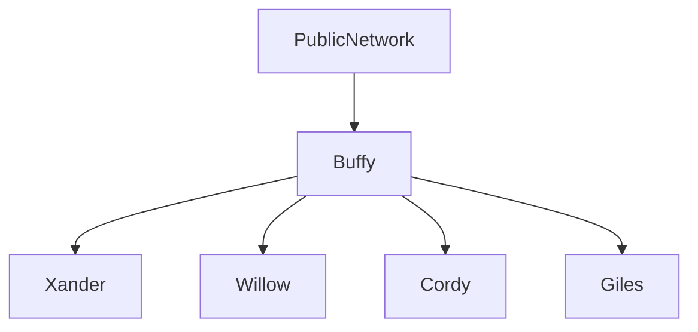

# Scooby

## Self-hosting RPi K3S cluster

Scooby is a template for building repeatable bare-metal Kubernetes clusters of one or more nodes.

Setting up your first bare metal K3S cluster can be a daunting undertaking, which can require a significant investment of time.

Scooby is an attempt to compile all those processes into a single deployable Linux image that can host a Kubernetes cluster out of the box, with as little user interaction as possible.

Scooby is designed to be easy to work with. Scooby will begin building a bootable Raspberry Pi image using its internal defaults when this repository is cloned.

It is highly recommended, however, to configure your cluster according to your requirements. Commit your changes, push, and wait for the image to build.

Features:

- From commit to bootable image in 15 minutes
- Centralized configuration
- Centralized storage
- Cluster versioning
- Network booted agents
- Ready-to-go build pipelines
- Github asset storage
- Optional S3 bucket uploader

## Required hardware

To get going, you will need at least one Raspberry Pi 3A or higher, and one local storage device (e.g. USB stick) per Pi.

If you are using two or more Pis you will also need an ethernet swithc or VLAN, and the master node will also need a second ethernet device. Several devices using the RTL-8152 chipset have been tested and work well. Driverless Ethernet hats that add a second Ethernet port to the Pi should also work well, but at the current time have not been tested.

Agent nodes perform well on Pi 3B+ but for performance reasons it is recommended to use a Pi 4B or greater for the master node, and a USB3 SSD for master node storage.

## Getting started

The easiest way to get started with Scooby is to create a new GitHub repository using this template.

Click the `use this template` button above, create a new repository, and clone it to your local machine.

## Setting up the Master node

The first file you will need to edit is `/config`, in the project root. This file contains information about the cluster's base operating system and network settings. There is an example configured with default values that you can uncomment and change to get you going. For example:

`/config`

```
# Base Raspberry Pi image and SHA
LC_IMAGE_HREF="http://downloads.raspberrypi.org/raspios_lite_arm64/images/raspios_lite_arm64-2022-01-28/2022-01-28-raspios-bullseye-arm64-lite.zip"
LC_IMAGE_SHA=sha256:d694d2838018cf0d152fe81031dba83182cee79f785c033844b520d222ac12f5

# Master node hostname
LC_HOSTNAME=buffy

# DNS providers
LC_PRIMARY_DNS=1.0.0.1
LC_SECONDARY_DNS=

# Master node external network configuration
LC_EXTERNAL_DEVICE=eth0
LC_EXTERNAL_IP=192.168.1.64
LC_EXTERNAL_NET=192.168.1.0/24
LC_EXTERNAL_GW=192.168.1.1
LC_EXTERNAL_DOMAIN=

# Master node cluster network configuration
LC_INTERNAL_IP=192.168.64.1
LC_INTERNAL_NET=192.168.64.0/24
LC_INTERNAL_DEVICE=eth1
LC_INTERNAL_DOMAIN=sunnydale
```

### Static files

Any files placed in the `/server` directory will be merged into the master node's root filesystem. They are persistent and available on first boot.

### Kubernetes Manifests

Kubernetes manifests should go in `/server/var/lib/rancher/k3s/server/manifests/`.

## Setting up the Agents

### Enable Pi network boot

Each agent must be setup for network booting. This part cannot be automated and you will need to perform it manually on each agent. Fortunately, it only needs to be done once and does not need to be done on the Pi 4.

There is an excellent guide detailing how to configure Raspberry Pi for network boot [here](https://metebalci.com/blog/bare-metal-rpi3-network-boot/).
The official Raspberry Pi documentation for [debugging network book mode](https://www.raspberrypi.com/documentation/computers/raspberry-pi.html#debugging-network-boot-mode) is also very useful.

### Agent definition

Create one file for each agent node you wish to create in the `agents` directory. This file contains information about the agent's network settings, storage and node-specific parameters. The name of the file should be the hostname of the agent with an extension of `.agent`.

For each agent, you will need to provide:

- the agent node's hardware address
- it's IPv4 address
- a UUID for a partition containing an ext4 filesystem for K3S persistent local storage\*
- the Pi's PXE client ID
- any extra args for K3s that the agent might need (optional)

For example:

`./agents/willow.agent`

```
AGENT_ETHERNET=b8:27:eb:81:1a:52
AGENT_IP=192.168.64.65
AGENT_RANCHER_PART_UUID=d5f9e6c2-493c-48da-baf2-0c63dd7a36b1
AGENT_PXE_ID=c6811a52
AGENT_K3S_ARGS="--node-label 'smarter-device-manager=enabled'"
```

- You can find the PXE client id of any Raspberry Pi with the following command:

```
$ cat /sys/firmware/devicetree/base/serial-number
```

- An incomplete or incorrect agent description will not result in a working agent node.

### Local Rancher Storage

Although the agent filesystems are served over the network, Rancher requires some storage on a local filesystem for each agent. It only needs to be created once and does not need to be re-created for subsequent deployments.

Scooby agents expect an ext4 partition on any local device, for example a USB storage key.

You can find the UUID of any partition using `blkid`. For example,

```
$ blkid --match-tag="PARTUUID" /dev/sda1
```

## Building

### Build locally

To build Scooby locally, you need Vagrant.

Once you have Vagrant, execute the following command in the project root:

```
$ ./scripts/build.sh
```

The output disk image will be found in `./images/scooby.img`. The image is typically in the region of 3.5GB.

### Building with Github Actions

Build the disk image by pushing a commit to any branch. When the build has completed you will see a zipped asset available to download in the `build` workflow.

### Defaults

Building with the defaults will produce a deployable image that:

- has only a master node
- contains no manifests
- cannot be accessed by SSH

### Secret environment variables

Scooby has the following secrets:

`LC_DEFAULT_USER` name of your default user for the cluster (default: spike)  
`LC_SSH_AUTH_KEY` an SSH auth key to access the cluster nodes (optional)  
`LC_PACKER_GITHUB_API_TOKEN` your Packer API token (optional)

- If you are building locally, you will need to set the secret environment variables in a file called `.env` in the project root.
- If you are building using the GHA pipeline, you will need to set these as action secrets in your repository settings.

### AWS S3 secrets

If you commit to main, Scooby can also attempt to upload the finished image to an AWS S3 bucket.

To enable S3 upload, create these secrets in your repository settings.

`AWS_ACCESS_KEY_ID` the Key ID for your AWS account  
`AWS_SECRET_ACCESS_KEY` the Secret Access Key for your AWS account  
`AWS_BUCKET_S3_URI` the S3 URI for your bucket account  
`AWS_REGION` the AWS region in which your bucket is located

### Action Runners

For convenience, Scooby is configured to use macos-latest by default. This is the only GitHub runner that currently provides Vagrant.

A self-hosted runner is recommended if you plan to make frequent changes.
If you wish to use a self-hosted runner, you will need to edit `.github/workflows/build.yml` and change `runs-on: macos-latest` to `runs-on: self-hosted`.

## Deploying

### Clone image

Once you have created and downloaded your image, clone it to the master node's storage device. For example:

```
$ dd oflag=sync,nocache bs=1M if=~/Downloads/scooby.img of=/dev/sdf
```

### Connect the Pis to the network

A typical Scooby network might look something like this:



Scooby uses Ethernet. Wifi is not supported.

The master node acts as a gateway for all network traffic originating inside the cluster that is destined for external networks. NAT is enabled for the agents using `iptables-persistent`.

Scooby is configured such that master node's `eth0` (usually the onboard Ethernet device) is the cluster's external or public interface, and `eth1` (e.g. the RTL-8152) is the cluster interface. Agent node `eth0` devices should exist on the same network as the master node's `eth1` device.

Clients on the external network may access services on the cluster via the master node's `eth0` device. Traefik cannot provide IP addresses by itself so it is recommended to provide them on the master node's `eth0` device with a MetalLB deployment on the master node.

To enable network boot services for agent nodes, the master node uses `dnsmasq` to provide PXE and DHCP services to the cluster on its `eth1` device. You should therefore not connect the master node's `eth1` device to any network with existing DHCP services.

## Power up the cluster

Once all your Pis are plugged into the network and all your storage devices are attached, it is time to power up the master node.

A master node called `buffy` would be ready when you see the following in the master node console:

```
BUFFY WILL PATROL TONIGHT
```

Allow the master node a few minutes following the above message before powering up any agents. `cloud-init` config files are served to the agents by `lighttpd` and it takes a moment to start.

You can watch the progress of your agent nodes coming online with the following command on the master node console:

```
$ kubectl get nodes -Aw
```

And eventually you should be rewarded with something like:

```
NAME     STATUS   ROLES                  AGE   VERSION
buffy    Ready    control-plane,master   25h   v1.27.4+k3s1
willow   Ready    <none>                 25h   v1.27.4+k3s1
xander   Ready    <none>                 24h   v1.27.4+k3s1
cordy    Ready    <none>                 25h   v1.27.4+k3s1
```

Congratulations! Your Raspberry Pi supercomputer is now complete :)

## Notes

### First boot

The master node will appear to go quiet on first boot.

There will be no console output after `cloud-init` has identified the network devices for about four minutes. This is a known issue, and is caused by `cloud-init` waiting for eth0 to become ready.

Cloud-init will eventually find the network interface and continue.

### RTL-8152

RTL-8152 USB to Ethernet devices are a good solution for adding extra connectivity to the Raspberry Pi but they can appear to the operating system as USB storage media when first inserted.

To ensure the device appears as an Ethernet device and not USB storage, add the following file to your project:

`/server/etc/udev/rules.d/10-modeswitch.rules`

```
ACTION=="add", SUBSYSTEM=="usb", ENV{ID_VENDOR_ID}=="0bda", ENV{ID_MODEL_ID}=="8152", RUN+="/usr/bin/usb_modeswitch -K -v 0bda -p 8151;/usr/bin/usb_modeswitch -v 0bda -p 8152 -R"
```

### MetalLB

An example MetalLB manifest in a Scooby deployment might look like:

`/server/var/lib/rancher/k3s/server/manifests/metallb.yml`

```
apiVersion: v1
kind: Namespace
metadata:
  name: metallb-system
---
apiVersion: helm.cattle.io/v1
kind: HelmChart
metadata:
  name: metallb-system
  namespace: kube-system
spec:
  repo: https://charts.bitnami.com/bitnami
  chart: metallb
  targetNamespace: metallb-system
---
apiVersion: metallb.io/v1beta1
kind: IPAddressPool
metadata:
  name: first-pool
  namespace: metallb-system
spec:
  addresses:
    - 192.168.1.65-192.168.1.127
---
apiVersion: metallb.io/v1beta1
kind: L2Advertisement
metadata:
  name: public-pool
  namespace: metallb-system
spec:
  interfaces: ["eth0"]
  ipAddressPools:
    - first-pool
  nodeSelectors:
    - matchLabels:
        kubernetes.io/hostname: buffy
```

### Pihole and DHCP

You can easily deploy Pihole to a Scooby cluster with a manifest like this:

`/server/var/lib/rancher/k3s/server/manifests/pihole.yml`

```
apiVersion: v1
kind: Namespace
metadata:
  name: pihole
  labels:
    name: traffic
---
apiVersion: helm.cattle.io/v1
kind: HelmChart
metadata:
  name: pihole
  namespace: pihole
spec:
  chart: pihole
  targetNamespace: pihole
  repo: https://mojo2600.github.io/pihole-kubernetes/
  valuesContent: |-
    ...
```

Pihole works well for DNS, but load balancers aren't designed to respond to broadcast traffic like DHCP requests.

You might find that Scooby's dnsmasq instance is an easier solution for serving DHCP to your external network than Pihole. Here is an example configuration file that will do that:

`/server/etc/dnsmasq.d/10-external-dhcp.conf`

```
domain=socal,192.168.1.0/24
interface=eth0

dhcp-range=tag:eth0,192.168.1.128,192.168.1.240
dhcp-option=tag:eth0,option:router,192.168.1.1
dhcp-option=tag:eth0,6,192.168.1.66

dhcp-host=30:05:5C:8E:ED:C3,192.168.1.10,snyder
dhcp-host=08:00:20:AA:BB:CC,192.168.1.11,joycey
```

### OverlayFS

Scooby uses OverlayFS for agent filesystems. Under some circumstances you may wish to return an agent to its pristine state and re-initialise it without re-deploying the entire cluster.

To do this, you will need to SSH into the master node and execute the following as root, changing the hostname to match the agent node in question.

```
$ exportfs -u faith:/mnt/scooby/agents/faith
$ umount /mnt/scooby/agents/faith
$ rm -rf /var/lib/scooby/agents/faith/*
$ rm -rf /var/lib/scooby/overlay/faith/*
$ mount -a
$ exportfs -a
```
